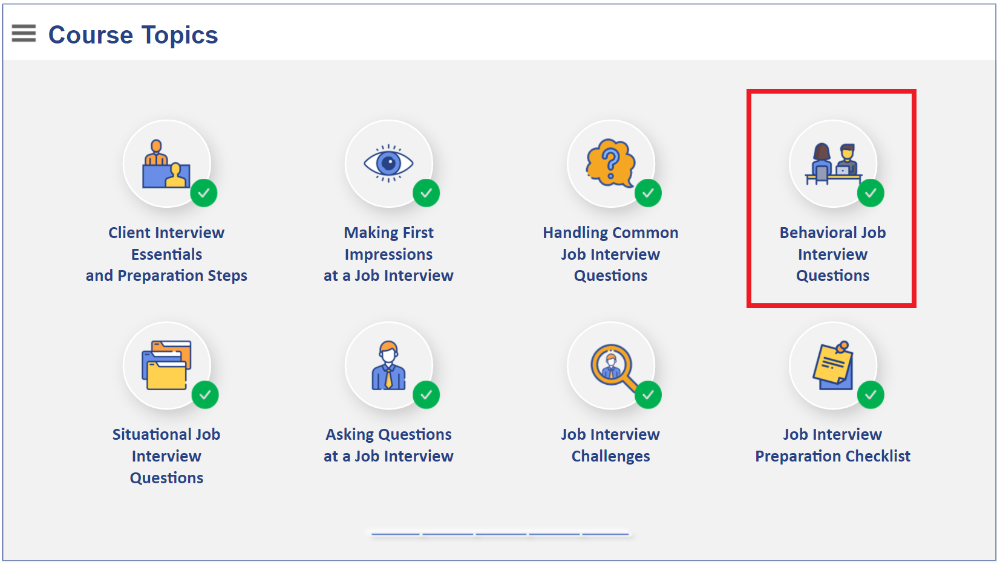
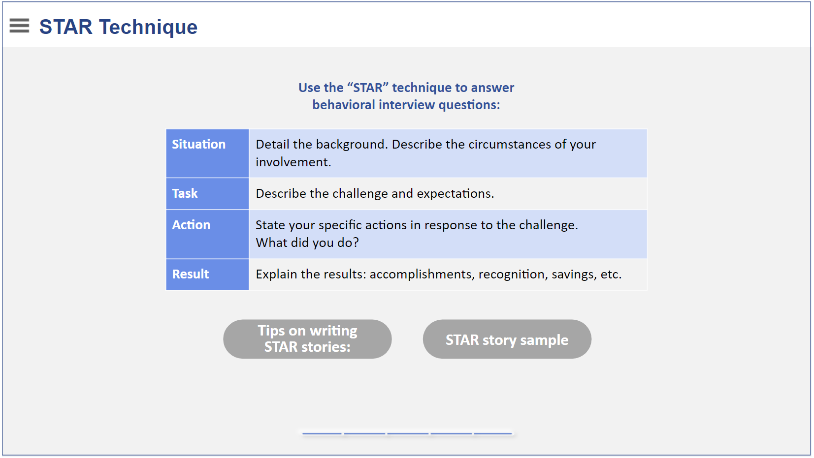
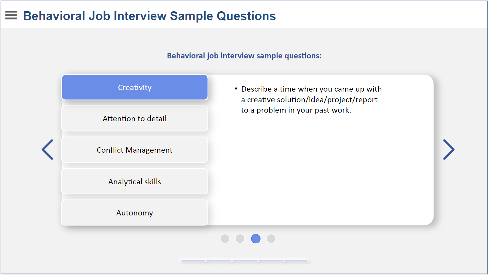
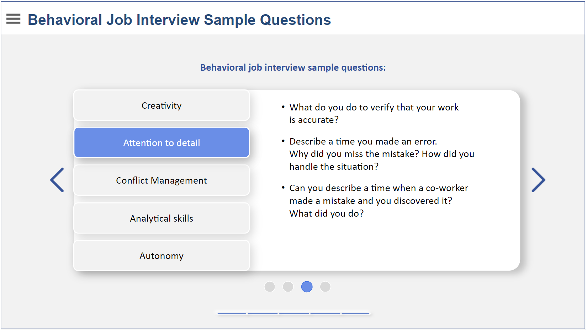
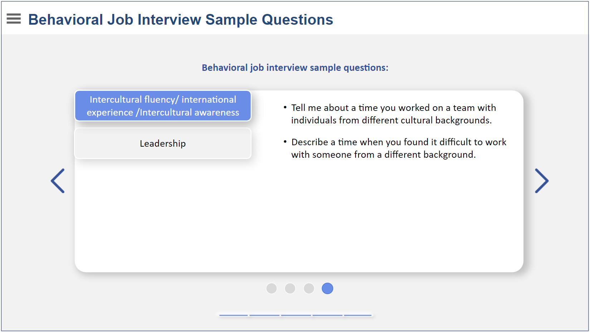

# Interview Preparation Tips

## Chapter 4: Behavioral Job Interview Questions `25 slides`

 
</img>
</img>
</img>
</img>
</img>
</img>
</img>
</img>
</img>
</img>
</img>
</img>
</img>
</img>
</img>
</img>
</img>
</img>
</img>
</img>
</img>
</img>
</img>
</img>
